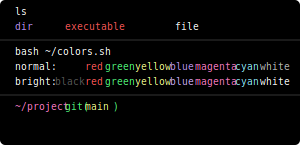

# Fancy Dracula Theme for Warp Terminal

This project extends the popular "Fancy Dracula" theme for [Warp Terminal](https://warp.dev) to other environments.

## Warp Terminal Theme Preview

The `fancy_dracula.yaml.svg` file in this repository provides a visual preview of the Fancy Dracula theme in Warp Terminal. This SVG file showcases:

### What the Preview Shows

The preview image demonstrates various terminal elements with the applied theme:

1. **Directory Listing Colors**
   - Directories: Displayed in purple (`#bd93f9`)
   - Executable files: Displayed in red (`#f55`)
   - Regular files: Displayed in white (`#fff`)

2. **Color Palette**
   - **Normal Colors:**
     - Black: Default terminal black
     - Red: `#f55`
     - Green: `#50fa7b`
     - Yellow: `#f1fa8c`
     - Blue: `#bd93f9`
     - Magenta: `#ff79c6`
     - Cyan: `#8be9fd`
     - White: `#bbb`

   - **Bright Colors:**
     - Black: `#555`
     - Red: `#f55`
     - Green: `#50fa7b`
     - Yellow: `#f1fa8c`
     - Blue: `#caa9fa` (slightly lighter than normal blue)
     - Magenta: `#ff79c6`
     - Cyan: `#8be9fd`
     - White: `#fff`

3. **Terminal Prompt Styling**
   - Directory path: Displayed in magenta (`#ff79c6`)
   - Git information:
     - Brackets/parentheses: Green (`#50fa7b`)
     - Branch name: Yellow (`#f1fa8c`)
   - Command cursor: Styled with accent color

## Installation in Warp Terminal

1. Open Warp Terminal
2. Go to Settings (⌘+,)
3. Select "Appearance" from the sidebar
4. Under "Theme", select "Fancy Dracula" from the dropdown menu
   - If not available in the default themes, you can import the theme by clicking "Import Theme" and selecting the `fancy_dracula.yaml` file

## Extending to Other Environments

This project aims to extend this color scheme to various other development environments to maintain a consistent look and feel across different tools.

## Acknowledgments

This theme is inspired by the original [Dracula Theme](https://draculatheme.com/) with some enhancements to create the "fancy" variant.
